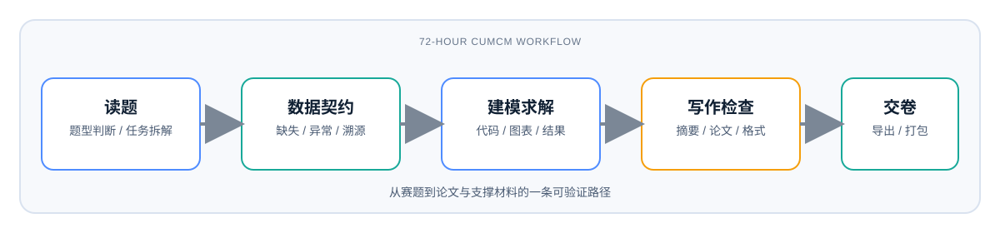

# CUMCM Skill Pack: AI 数学建模国赛全流程助手

[](#)
[](#)
[](#)
[](#)
[](#)
[](#)

一套面向 **全国大学生数学建模竞赛（CUMCM）** 的 AI 参赛 skill 包，覆盖从读题、数据探索、建模求解、论文写作、格式检查到支撑材料打包的完整 72 小时工作流。

它不是简单提示词合集，而是一个带 **论文模板、脚本工具、评测体系、反幻觉溯源约束、历年题型经验库** 的可安装技能包。

[](examples/2023C-workflow-demo.md)

[English README](README_EN.md) · [2023C Demo](examples/2023C-workflow-demo.md) · [质量评估框架](EVALUATION.md)

## 为什么值得 Star

- **开赛能直接用**：一键创建比赛工作区，预置 `0_赛题`、`1_数据`、`2_代码`、`3_图表`、`4_论文`、`5_支撑材料`。
- **覆盖国赛真实流程**：读题选题、数据契约、模型选择、代码求解、论文七章结构、交卷检查全部串起来。
- **反 AI 幻觉**：论文数值必须能从数据文件和运行结果溯源，图表必须由代码生成，文献不得编造。
- **有工程化验收**：`checks.py`、`verify.py`、`format-check.py`、`auto-score.py` 用来判断一次优化是变好还是变坏。
- **适配主流 Agent**：支持 Claude Code、OpenAI Codex、opencode 的 skill 目录结构。

## 30 秒看懂

你对 AI 说：

```text
我拿到 2026 国赛 C 题了。请按 cumcm skill 建立工作区，读题，判断题型，给出每问建模路线。
```

AI 应该输出：

```text
题目四层结构：背景 / 问题1-N / 数据说明 / 结果要求
题型判断：C 题，数据分析 + 预测 + 优化
技术路线：数据侧写 -> 相关性分析 -> 预测模型 -> 优化模型 -> 灵敏度分析
工作区：已创建 0_赛题、1_数据、2_代码、3_图表、4_论文、5_支撑材料
下一步：读取附件并生成 1_数据/data_contract.json
```

完整输出风格见：[examples/2023C-workflow-demo.md](examples/2023C-workflow-demo.md)。

## 快速开始

克隆项目：

```powershell
git clone https://github.com/ciyuan1234/MCM_skills.git
cd MCM_skills
```

Windows 安装：

```powershell
.\install.ps1
```

macOS / Linux 安装：

```bash
chmod +x install.sh
./install.sh
```

安装后重启你的 Agent 工具，然后用自然语言触发：

```text
建立数学建模比赛工作目录，并按 CUMCM 六阶段流程开始。
```

脚本会把 `cumcm/` 复制到这些位置：

| 工具 | 安装目录 |
|---|---|
| Claude Code | `~/.claude/skills/cumcm` |
| OpenAI Codex | `~/.codex/skills/cumcm` |
| AGENTS 标准 | `~/.agents/skills/cumcm` |
| opencode | `~/.config/opencode/skills/cumcm` |

## 核心能力

| 阶段 | 能力 | 产物 |
|---|---|---|
| Phase 0 | 读题、拆解任务、判断 A-E 题型 | 题目结构、技术路线、选题建议 |
| Phase 1 | 数据侧写、缺失/异常/重复检查 | 数据质量报告、`data_contract.json` |
| Phase 2 | 模型选择、代码求解、结果检验 | 可运行代码、结果表、图表 |
| Phase 3 | 摘要、正文、图表、参考文献 | `paper.md` / `paper.tex` / `paper.docx` |
| Phase 4 | 格式检查、溯源检查、导出 PDF | 检查报告、论文 PDF |
| Phase 5 | 支撑材料整理与打包 | 提交 zip |

## 目录结构

```text
MCM_skills/
├── install.ps1 / install.sh       # 一键安装
├── README.md / README_EN.md       # 中英文入口
├── EVALUATION.md                  # 质量评估框架
├── examples/                      # Demo 输出样例
├── evaluation/                    # benchmark、评分表、获奖论文经验库
└── cumcm/
    ├── SKILL.md                   # skill 编排层
    ├── references/                # 赛制、模型、写作、检查清单
    ├── scripts/                   # 工作区、契约、检查、导出、打包工具
    └── assets/                    # 论文模板、绘图模板、进度日志模板
```

## 常用命令

创建比赛工作区：

```powershell
.\cumcm\scripts\scaffold.ps1 -WorkDir .\workspace
```

生成数据契约：

```powershell
python .\cumcm\scripts\make-data-contract.py .\workspace\1_数据 -o .\workspace\1_数据\data_contract.json
```

检查论文：

```powershell
python .\cumcm\scripts\checks.py .\workspace\4_论文\paper.md .\workspace
python .\cumcm\scripts\verify.py .\workspace
python .\cumcm\scripts\format-check.py .\workspace
```

导出论文并打包支撑材料：

```powershell
.\cumcm\scripts\export-paper.ps1 -WorkDir .\workspace -Force
.\cumcm\scripts\package.ps1 -WorkDir .\workspace
```

## 推荐依赖

- Python 3.8+
- `numpy`、`scipy`、`pandas`、`matplotlib`、`sympy`、`scikit-learn`
- 可选：MiKTeX / TeX Live，用于 `xelatex` 导出高质量 PDF
- 可选：Microsoft Office，用于 Word COM 转 PDF

Windows 安装 MiKTeX：

```powershell
winget install MiKTeX.MiKTeX
& "$env:LOCALAPPDATA\Programs\MiKTeX\miktex\bin\x64\initexmf.exe" --set-config-value "[MPM]AutoInstall=1"
```

## 防幻觉红线

本项目把“不要编造”落成了可检查规则：

- 数据必须来自真实文件，Phase 1 必须生成 `1_数据/data_contract.json`。
- 代码必须显式读取数据文件，禁止把关键数据硬编码进脚本。
- 论文数值必须能在运行结果或数据契约中找到出处。
- 图表必须由代码从数据生成，图例和对象数必须与数据一致。
- 参考文献只列真实读过的资料。
- 每个模型必须做误差、稳定性或灵敏度分析。

## 质量评估

项目内置三层回归：

| 层级 | 目标 | 工具 |
|---|---|---|
| Tier 0 | 工具自检 | scaffold / checks / verify / format-check / package |
| Tier 1 | 小型端到端 fixture | `evaluation/run-tier1.ps1` + `auto-score.py` |
| Tier 2 | 往届真题盲测 | `evaluation/run-tier2.ps1` + 盲评量表 |

详细规则见：[EVALUATION.md](EVALUATION.md)。

## 适合谁

- 正在准备 CUMCM / 数学建模国赛的队伍
- 数学建模社团、培训营、课程助教
- 想把 AI Agent 用到严肃建模任务的人
- 想研究“AI + 可验证工作流”的开发者

## 推荐 GitHub Topics

如果你 fork 或二次开发，建议添加这些 topics，方便更多人搜到：

`cumcm` `mathematical-modeling` `ai-agent` `codex` `claude-code` `opencode` `skills` `latex` `python`

## Roadmap

- [x] 增加工作流视觉入口：README 首屏已嵌入 workflow overview
- [ ] 增加 GitHub Actions：脚本语法检查和 Tier 1 冒烟测试
- [ ] 增加 `LICENSE` 和贡献指南
- [ ] 补充更多往届题的端到端公开 demo
- [ ] 将中文资料库索引拆成可选扩展包

## 分享文案

项目简介与发布文案见：[PROMOTION.md](PROMOTION.md)。

## Changelog

- **v1.5.2**（2026-08-16）：导出链路稳健性优化。`export-paper.ps1` 增加 Python 发现与调用封装，自动尝试 `python`/`python3`/`py -3`；修复 Markdown 直转 LaTeX 分支误用 `$xelatex.Source`；当 PDF 或 `paper.tex` 落后于 `paper.md`/`md2tex.py` 时自动重编译。`md2tex.py` 增强宽表排版、兼容 `**表N**` 题注写法，并保留 `$...$` 行内公式。
- **v1.5.1**（2026-08-16）：2023C Q2 增加显式时序预测基线，补齐预测精度、论文数值链和支撑材料。
- **v1.5.0**（2026-08-16）：沉淀 2023 年获奖论文经验库与评阅视角，强化差异化创新流程。
- **v1.4.0**（2026-08-16）：新增 LaTeX 编译路线、正文页数硬标准、篇幅密度检查和创新点定位。
- **v1.3.0**（2026-08）：上线格式硬检查体系，补充摘要、引用、附录、图表题注和负样本验证。
- **v1.2.5**（2026-08）：工具链收尾，多 sheet 数据契约、安装验证和 Tier 2 命名匹配。
- **v1.0.0**（2026-08）：首个完整版本。
